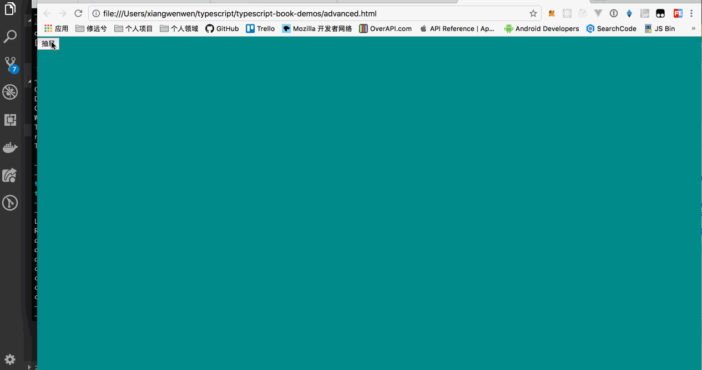

除了 TypeScript 本身的特性之外，我们又回到了前端最本质的工作上，在没有使用现代 Web 前端框架的情况下，我们要做一个类似抽屉柜一样的效果。

两周之后，产品 `小向` 跟 `小明` 说很希望在列表的旁边做一个类型抽屉柜的效果，将原来的个人信息，放置在这个抽屉柜中，这样来说用户体验相对会比较舒适。`小明` 看了一眼视觉稿，“比较好弄”，于是愉快的答应了。在将写代码之前，`小明` 粗略的绘制了一下样式和结构：

```html
<div id="action-container" class="action-container">
  <button id="action">抽屉</button>
</div>
<div id="container" class="container"></div>
```

```css
html,body{
  width: 100%;
  height: 100%;
}
body{
  margin: 0px;
  padding: 0px;
}

.action-container{
  width: 100%;
  height: 100%;
  background: darkcyan;
  margin-left: 0px;
}

.container {
  width: 200px;
  height: 1000px;
  position: absolute;
  top: 0px;
  left: -200px;
  background: red;
}
```

接着 `小明` 想了想定义了一个接口 `IDrawerConfig` 和 类 `Drawer`，它应该有如下几个属性：

- 动画持续的时间
- ease
- 动画的容器对象

```javascript
interface IDrawerConfig {
  duraction?: number;
  ease?: Ease
  enterDOM: HTMLElement| null,
  leaveDOM: HTMLElement | null;
}
```

```javascript
class Drawer{

}
```

dom 元素也应该赋值上初始的 `transition`：

```javascript
initDOMStyle(){
  if (this.enterDOM && this.leaveDOM){
    this.enterDOM.setAttribute("style", `transition: left ${this.duration}s ${this.ease};`);
    this.leaveDOM.setAttribute("style", `transition: margin-left ${this.duration}s ${this.ease};`);
  }
}
```

在初始化完 `transition` 之后，`小明` 咬着指头想了想，接下来得处理动画的持续时间和模式。

由于动画的持续时间和`ease` 是一个动态更新的过程，并且 `ease` 字符串也是一个固定的三个模式，于是 `小明` 在这里不仅用了两个存取器来处理这个问题，还定义了一个限制类型，方便使用方直接 `set` 的时候就直接更新了 `transition`：

```javascript

public _duraction: number;
public _ease: Ease;

get duration() {
  return this._duraction;
}

set duration(duraction: number) {
  this._duraction = duraction;
  this.updateTransition();
}

get ease() {
  return this._ease;
}

set ease(ease: Ease){
  this._ease = ease;
  this.updateTransition();
} 

private updateTransition(){
  this.enterTransition = `left: 0px;transition: left ${this.duration}s ${this.ease};`;
  this.leaveTransition = `transition: margin-left ${this.duration}s ${this.ease}; margin-left: 200px;`
}
```

接下来，`小明` 开始着手写动画的开始和离开，如：

```javascript
public enter(){
  if (this.enterDOM && this.leaveDOM) {
    this.enterDOM.setAttribute("style", this.enterTransition);
    this.leaveDOM.setAttribute("style", this.leaveTransition);
  }
}

public leave(){
  this.initDOMStyle();
}
```

看起来动画的过程都有了，下一步 `小明` 要给列表页面的旁边加上一个按钮，用户点击时就像抽屉柜一样，既可拉出也可收起来。

```javascript
let state = true;
const action = document.getElementById("action");
const container = document.getElementById("container");
const actionContainer = document.getElementById("action-container");
const drawer = new Drawer({
  enterDOM: container,
  leaveDOM: actionContainer
});
if (action) {
  action.addEventListener("click", () => {
    if (state) {
      state = false;
      drawer.enter();
    } else {
      state = true;
      drawer.leave();
    }
  });
}
```

如图：



## 总结

类就是一个描述的过程，在面向对象程序设计中，任何事物都有一个抽象的描述过程，一个事物有属性，也有动作，而类就是程序中用于描述这个事物的具体实现。虽然上述的例子，只用到了类的几个特性，甚至连继承都没有使用到。让我们看一看完整的例子：[]()，在这个例子中，我们用到了构造函数，用到了公开属性，用到了存取器，用到了方法，用到了限定类型。

于是，我们在设想这个动画时，只模拟到了它非常具体的描述，比如 `left` `margin-left` `duraction` `ease` 这些属性构成了一个动画的 style，但是我们还应该需要开始和离开的动作，因此定义了 `enter` 和 `leave` 方法，提供给外部使用。

写到这里，我想尝试阐述的是，类和面向对象程序设计，并不会成为阻碍，反而在某些抽象的模块中，类的良好设计非常有助于你来描述这样一段逻辑。
