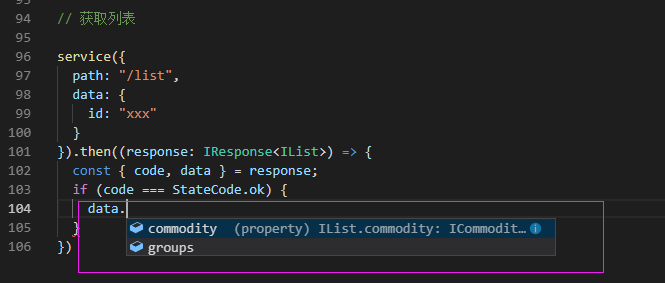
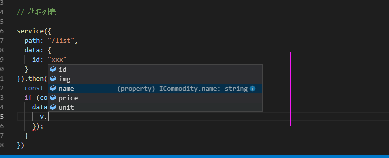
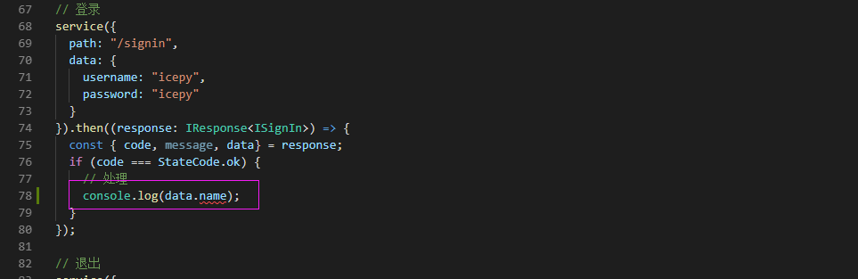

不知不觉冬去春来，`小明` 也换了一份工作，这次他在新的公司里开始负责设计前端项目，一切都从新的开始。有一天 `小明` 和 公司的后端程序员`小李` 愉快的对完了接口文档，于是开始埋头苦干。由于请求的异步性，`小明` 随着知识学习的增长也开始使用 `Promise`，他对于接口的约定，在实现上也会去考虑复用性，于是 `小明` 和 `小李` 完成了一项非常重要的约定：

```javascript

{
  code: 200,
  message: "",
  data: {}
}

```

所有的接口都遵从这样的格式。

- `code` 代表接口的成功与失败
- `message` 代表接口失败之后的服务端消息输出
- `data` 代表接口成功之后真正的逻辑

第一期功能的实现一共有三个接口，分别是：

- 登录
- 获取列表
- 退出

`小明` 使用泛型定义了一个 `response` 的类型，如：

```javascript

export enum StateCode {
  error = 400,
  ok = 200,
  timeout = 408,
  serviceError = 500
}

export interface IResponse<T = any> {
  code: StateCode;
  message: string;
  data: T;
}
```

接着 `小明` 实现了另外三个接口，这是与后端程序员 `小李` 一起约定好的格式，如：

```javascript
export interface ISignOut {
  signOut: boolean;
}

export interface ISignIn{
  Id: string;
  name: string;
  avatar: string;
  permissions: number[];
}

export interface ICommodity {
  id: string;
  img: string;
  name: string;
  price: number;
  unit: string;
}

export interface IFavorites {
  id: string;
  img: string;
  name: string;
  url: string;
}

export interface IList {
  commodity: ICommodity[];
  groups: IFavorites[];
}
```

由于已经约定好了接口统一使用 `POST`，Path 也有固定的地址，因此接下来 `小明` 利用一个开源请求库 `axios` 编写了一个比较通用的HTTP函数用于项目中：

```javascript
const ROOT = "https://icepy.me"

export function service({ path, data}: IRequest): Promise<IResponse>{
  return new Promise((resolve) => {
    const request: AxiosRequestConfig = {
      url: `${ROOT}/${path}`,
      method: "POST",
      data: data
    }
    axios(request).then((response: AxiosResponse<IResponse>) => {
      resolve(response.data);
    })
  });
}
```

`小明` 休息了会儿，然后大概花了五分钟左右的时间实现了三个接口的业务逻辑：

```javascript

// 登录
service({
  path: "/signin",
  data: {
    username: "icepy",
    password: "icepy"
  }
}).then((response: IResponse<ISignIn>) => {
  const { code, message, data} = response;
  if (code === StateCode.ok) {
    // 处理 
  }
});

// 退出
service({
  path: "/signout",
  data: {
    id:  "xxx"
  }
}).then((response: IResponse<ISignOut>) => {
  const { code } = response;
  if (code === StateCode.ok) {
    window.location.reload();
  }
})

// 获取列表

service({
  path: "/list",
  data: {
    id: "xxx"
  }
}).then((response: IResponse<IList>) => {
  const { code, data } = response;
  if (code === StateCode.ok) {
    data.commodity.map((v: ICommodity) => {
      
    });
  }
})
```

每一个接口的实现，我们都可以从约定的类型中得到 TypeScript 工具的支持，如图：






看了看手表，才 `6点半`，于是 `小明` 愉快的下班去请女朋友吃饭了，第二天后端程序员 `小李` 表示很羡慕，一周之后，`小李`告诉 `小明`，由于之前约定的登录接口 `name` 字段不是很好，现在改成了 `nickname`，这要是搁以前，`小明` 肯定懵了，`小李`笑而不语，（PS：谁叫你下班早），不过不要紧，由于我们使用的是 TypeScript，`小明` 在 `ISignin` 接口中将 `name` 改成了 `nickname`，于是编辑给了 `小明` 很明确的反馈，如图：



五分钟之后，`小明` 愉快的修改完成，看了看手表，`6点`了，准备好和女朋友共进晚餐。

## 总结

这就是泛型在HTTP接口实现中一个很帮的运用，在我们学习完基础的泛型知识后，我们可以将它快速的设计到我们的工作项目中，现代 Web前端项目，随着业务量的增加，接口也在增加，我们大量的业务逻辑都是依赖于接口而设计的，可以说目前我们用的大部分 Web应用，都无法避免不使用HTTP接口来实现业务逻辑。当随着代码量的增加，我们从中获取到更多的收益，当然泛型除了用于此处之外，还有很多更有趣的用法。