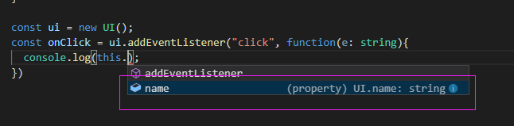
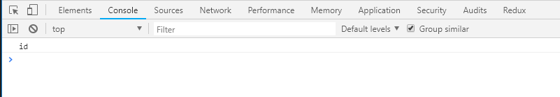

我们都知道在 JavaScript 的世界中 `函数` 是一等公民，它在编程范式中为我们控制行为，抽象某些实现有着较大的帮助，因此 TypeScript 在 JavaScript 的基础之上添加了一些额外的功能，辅助我们更好的使用函数。

## 基础

当我们随意定义一个函数时，如：

```javascript

function sum(x,y) {
  return x + y;
}
```

我们很难从类型上找到预期的行为，即：

- x, y 必须是 number
- sum 返回一个 number

TypeScript 为这样的函数增加了类型范式：

```javascript

function sum(x: number, y: number): number {
  return x + y;
}
```

当然，如果你喜欢，也可以使用函数表达式，如：

```javascript
const sum = function (x: number, y: number): number {
  return x + y;
}
```

不过由于 TypeScript 可以根据 return 来推断返回的类型，因此有时候返回类型 number 并不是一定要书写的，不过为了给人阅读时不增加不必要的开支，写上明确的返回类型，是一种非常好的习惯。还有一点的是，虽然上述的代码我们已经为其添加了类型，不过这还不是一个很完整的类型书写，但往往我们可以忽略它，如：

```javascript

type Sum = (x: number, y: number) => number;

const sum: Sum = function(x: number, y: number): number {
  return x + y;
}
```

以往我们写 JavaScript 时调用  `sum` 函数，也许我们什么都不传，或者只传一个，但在 TypeScript 的世界中参数是必须真时存在的，我们调用时必须传递两个参数，因此我们可以使用 `可选参数` 和 `默认参数` 的方式来处理这个问题，如：

```javascript
function sum(x: number, y?: number): number {

}

```

```javascript
function sum(x: number, y = 0): number {

}
```

不知道小伙伴们对于 `arguments` 还有没有印象，对于 TypeScript 来说它也提供了这样的机制来处理这样的问题，如：

```javascript
function sum(...num: number[]): number {
  return num[0] + num[1];
}
```

上述就是在 TypeScript 中一些函数的用法，不过这还不是重点，重点在于我们要理解 JavaScript 中的 `this`，对于它来说只有理解了它才算的上经过了一次成人礼。简单的来说由于 TypeScript 是 JavaScript 的超集，因此它可能会比我们人更了解当你错误使用 `this` 时的情况，这一点上，有时候机器确实比人要靠谱的多。我们不讨论这些具体的 `this`，当然我默认了你已经对 JavaScript 的 `this` 十分了解，多数情况下，我们可以使用箭头函数来避免一些问题，如：

```javascript

let o = {
  a: 1,
  b: function (){
    return () => {
      return this.a;
    }
  }
}

```

如果你没有使用箭头函数，那么这里的 `this.a` 会得到一个错误，因为此时的 `this` 会被设置为一个全局的对象，浏览器中是 window ，Node.js里是 global。

由于本身 JavaScript 并没有对函数提供重载功能，这个特性其实在某些情况下特别有用，根据不同的参数来返回不同的类型，在同样的一个函数中，如：

```javascript

function sync(x: number): number;
function sync(x: { code: number, sig: string}): string;
function sync(x: any): any {
  if (typeof x === "number") {
    return 0;
  }
  if (typeof x === "string") {
    return "0";
  }
}

sync(0);
```

## 范例

`小明` 对于公司的一个支付需要写一个监听函数，用于获取用户点击支付时的金额，并且还要写一个函数，这个函数用于计算最后的金额，如：

```javascript

const typed = document.getElementById("typed");
if (typed) {
  const pay = function(current: number, discount: number): number{
    return current * (discount/100);
  }
  typed.addEventListener("click", function(this: HTMLElement ,ev: MouseEvent){
    pay(1000, 20);
  });
}
```

在这个例子中不仅用到了函数的类型，还有一个特别有意思的 `this` 的问题，请看如下这一段：

```javascript
typed.addEventListener("click", function(this: HTMLElement ,ev: MouseEvent){
  pay(1000, 20);
});

this: HTMLElement

```

这里的 `this` 是要解决什么问题？

其实是非常明确的指明 `addEventListener` 的 handler 函数的 this 的问题，这个 this 是指向了一个 HTML 元素对象，举个具体的例子，假设我们自己写了一个UI组件，提供了一个 `addEventListener` ，在处理 handler 函数时，应该将 this 指向这个这个UI组件实例，在 TypeScript 中该如何写？

```javascript

class UI {
  public name: string;
  constructor(){
    this.name = "id";
  }
  public addEventListener(type: string, handler: (this: UI, e: string) => void) {
    ///
    handler.call(this, this.name);
  } 
}

const ui = new UI();
const onClick = ui.addEventListener("click", function(e: string){
  console.log(this.name);
})

```

如图：





完整的例子：[https://github.com/welearnmore/typescript-book-demos/blob/master/function.ts](https://github.com/welearnmore/typescript-book-demos/blob/master/function.ts)