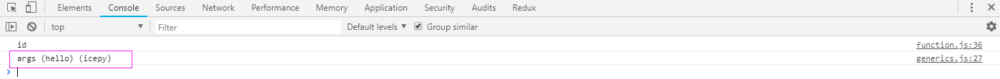

在软件工程领域，我们不仅要创建定义一致良好的API，也需要同时考虑重用性，泛型就给予了这样的灵活性又不失优雅。

## 基础

让我们先来创建一个简单的泛型函数：

```javascript
function r<T>(args: T): T {
  return args;
}
r("icepy");
r(100)
r(true)
```

当我们并不知道返回类型时，泛型函数就解决了这样的问题，虽然这看起来和 `Any` 非常的类似。由于我们定义的是泛型函数，因此它并不会丢失类型，反而会根据我们传入的参数类型而返回一个类型，这也意味着我们可以将它适用于多个类型。

### 为我们的 r 函数创建泛型类型

```javascript

type GenericsR = <T>(args: T) => T;

function r<T>(args: T): T {
  return args;
}

const _r: GenericsR = r;
```

创建类型，其实仅是从编程风格上来说更统一和方便使用。

### 泛型类

泛型类其实看上去和定义一个泛型函数很类似，如：

```javascript
class GenericsClass<T>{
  public add?: (x: T, y: T) => T;
}

const cls = new GenericsClass<number>();
cls.add = (x: number, y: number): number => {
  return x + y;
}

```

看起来仅仅是为了约束大家使用同一种类型而已。


## 范例

泛型为我们适用于多类型返回变成了可能，这一天 `小明` 开始在公司内完善一个很简单的输出函数，用于解决另外一个支付的问题，它有如下几个特性：

- 传入字符串时，返回一个字符串
- 传入数值时，返回一个数值

```javascript

function xr<T> (args: T, handler?: <R> (result: R) => void): void{
  if (handler && typeof handler === "function") {
    if (typeof args === "number") {
      handler(args + 1);
    }
    if (typeof args === "string") {
      handler(`args (${ args }) (icepy)`);
    }
  }
}

xr("hello", <R> (result: R) => {
  console.log(result);
});

```

如图：



完整的例子：[https://github.com/welearnmore/typescript-book-demos/blob/master/generics.ts](https://github.com/welearnmore/typescript-book-demos/blob/master/generics.ts)