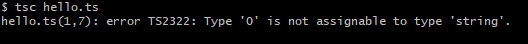

传统意义上的 JavaScript 是一个非常松散的语言，因此在以往的面试过程中，很大几率会问及类型以及一些区别。但更传统的软件工程中我们常常在使用的是由编译器进行过编译的语言（转换成了机器实际可运行的格式），由于编译阶段的存在，我们可以更易于找到错误和进行优化（想想 JavaScript 为什么要总结那么多的编程范例，"" + "" 和 [].join() 的区别）。虽然看起来 TypeScript 就是一个增强 JavaScript 的工具，但是它也可以成为启用其他工具的工具，最简单的比如：抽象语法树（AST）。

做为 [《浅谈 TypeScript》](https://github.com/welearnmore/typescript-book) 小书的开篇前言，我们不会讲到编译的过程，反而我们这本小书更注重 TypeScript 本身的运用，根据国际惯例，我们还是会讲到一些介绍性的内容，比如：

- TypeScript 是什么
- 使用 TypeScript 的收益是什么
- 如何书写一段简单的 TypeScript 例子
- 展望一下未来


## TypeScript 是什么

我们需要认准官方网站的入口：[http://www.typescriptlang.org/](http://www.typescriptlang.org/)，并引用一段 `官网的介绍`:

> TypeScript is a typed superset of JavaScript that compiles to plain JavaScript. Any browser. Any Host. Any OS. Open source.

其实在这里，你就能很明白 TypeScript 是什么了，做为 JavaScript 的超集，它添加了非常强健的静态类型系统，可以用于 Web 网页，也可以用于 Node.js，只要是 JavaScript 可以运行的地方，它都可以运行。

## 使用 TypeScript 的收益是什么

举个简单的例子，`小明` 公司的业务有超过十万+的 JavaScript 代码和 100+ 的接口，他们公司的后端程序员 `小李` 根据公司业务的发展需求，变更了一些接口和字段，由于 JavaScript 没有编译阶段的类型检查，`小明` 根据前人留下的文档和记忆，只能一个文件一个文件的修改，并且在心里默默骂道：`真坑`，当 `小明` 加班了一个晚上看起来改的差不多了，由于老板催的急，于是发布上线，第二天 `小李` 表示就再也没有在公司见到过 `小明`。当我们有了 TypeScript 之后该怎么办呢？由于我们的接口字段已经定义了 `interface` ，因此 `小明` 只需要将定义的接口中的某个字段改个名字，如果你使用了 `VSCode` ，有依赖这个接口的所有代码都将标记一个红色的反馈。（当然，你也可以编译一次） ，于是 `小明` 愉快的在没有前人文档的情况下，正确的发布上线了，第二天 `小李` 发现 `小明` 涨薪了。 

言归正传，当我们使用 TypeScript 时，也许能收获如下收益：

- 强大的静态类型系统
- 完善的内部代码库
- 几乎所有的 API 都能得到准确的智能提示
- 正统的编程范式
- 可以帮助你的团队更好的理解架构内部的数据流向

说了这么多，其实我个人的看法是我们可以更明确的输出文档式的接口声明，这在前端的应用中非常的有用，就如我开玩笑式的举例也许有一天你将面临同样的问题。反而当我们使用类型数量（TypeScript）的增加，我们迟早会从中获益，并且 TypeScript 还会去理解你的代码，并为你的工作提供更好的支持。

## 范例

```bash
$ npm i -g typescript
```

TypeScript 的编译器可以全局安装也可以局部安装，它是一个很有用的 Node.js 模块，当我们全局安装它时，我们就能在命令行中通过 `tsc` 来运行它。

创建一个 `hello.ts` 文件，并写入：

```javascript

const hello: string = 0;

```

运行一下 `tsc hello.ts` 看一看效果，如图：




当我们声明了一个字符串的常量，但却赋值了一个数值，于是在编译过程中，就得到了一个错误，这是 TypeScript 教学式的运用。当我们将 TypeScript 引用在真实的项目中时，肯定就不会这么来用了。

现代的 Web 前端工程几乎都用到了构建工具，如 `webpack`：

```bash
npm i awesome-typescript-loader typescript source-map-loader --dev
```

使用 `tsc --init` 创建 tsconfig.json，这是整个工程内 TypeScript 编译器所依赖的配置文件：

```javascript
{
  "compilerOptions": {
    /* Basic Options */
    "target": "es5",                          /* Specify ECMAScript target version: 'ES3' (default), 'ES5', 'ES2015', 'ES2016', 'ES2017','ES2018' or 'ESNEXT'. */
    "module": "commonjs",                     /* Specify module code generation: 'none', 'commonjs', 'amd', 'system', 'umd', 'es2015', or 'ESNext'. */
    // "lib": [],                             /* Specify library files to be included in the compilation. */
    // "allowJs": true,                       /* Allow javascript files to be compiled. */
    // "checkJs": true,                       /* Report errors in .js files. */
    // "jsx": "preserve",                     /* Specify JSX code generation: 'preserve', 'react-native', or 'react'. */
    // "declaration": true,                   /* Generates corresponding '.d.ts' file. */
    // "declarationMap": true,                /* Generates a sourcemap for each corresponding '.d.ts' file. */
    // "sourceMap": true,                     /* Generates corresponding '.map' file. */
    // "outFile": "./",                       /* Concatenate and emit output to single file. */
    // "outDir": "./",                        /* Redirect output structure to the directory. */
    // "rootDir": "./",                       /* Specify the root directory of input files. Use to control the output directory structure with --outDir. */
    // "composite": true,                     /* Enable project compilation */
    // "removeComments": true,                /* Do not emit comments to output. */
    // "noEmit": true,                        /* Do not emit outputs. */
    // "importHelpers": true,                 /* Import emit helpers from 'tslib'. */
    // "downlevelIteration": true,            /* Provide full support for iterables in 'for-of', spread, and destructuring when targeting 'ES5' or 'ES3'. */
    // "isolatedModules": true,               /* Transpile each file as a separate module (similar to 'ts.transpileModule'). */

    /* Strict Type-Checking Options */
    "strict": true,                           /* Enable all strict type-checking options. */
    // "noImplicitAny": true,                 /* Raise error on expressions and declarations with an implied 'any' type. */
    // "strictNullChecks": true,              /* Enable strict null checks. */
    // "strictFunctionTypes": true,           /* Enable strict checking of function types. */
    // "strictPropertyInitialization": true,  /* Enable strict checking of property initialization in classes. */
    // "noImplicitThis": true,                /* Raise error on 'this' expressions with an implied 'any' type. */
    // "alwaysStrict": true,                  /* Parse in strict mode and emit "use strict" for each source file. */

    /* Additional Checks */
    // "noUnusedLocals": true,                /* Report errors on unused locals. */
    // "noUnusedParameters": true,            /* Report errors on unused parameters. */
    // "noImplicitReturns": true,             /* Report error when not all code paths in function return a value. */
    // "noFallthroughCasesInSwitch": true,    /* Report errors for fallthrough cases in switch statement. */

    /* Module Resolution Options */
    // "moduleResolution": "node",            /* Specify module resolution strategy: 'node' (Node.js) or 'classic' (TypeScript pre-1.6). */
    // "baseUrl": "./",                       /* Base directory to resolve non-absolute module names. */
    // "paths": {},                           /* A series of entries which re-map imports to lookup locations relative to the 'baseUrl'. */
    // "rootDirs": [],                        /* List of root folders whose combined content represents the structure of the project at runtime. */
    // "typeRoots": [],                       /* List of folders to include type definitions from. */
    // "types": [],                           /* Type declaration files to be included in compilation. */
    // "allowSyntheticDefaultImports": true,  /* Allow default imports from modules with no default export. This does not affect code emit, just typechecking. */
    "esModuleInterop": true                   /* Enables emit interoperability between CommonJS and ES Modules via creation of namespace objects for all imports. Implies 'allowSyntheticDefaultImports'. */
    // "preserveSymlinks": true,              /* Do not resolve the real path of symlinks. */

    /* Source Map Options */
    // "sourceRoot": "",                      /* Specify the location where debugger should locate TypeScript files instead of source locations. */
    // "mapRoot": "",                         /* Specify the location where debugger should locate map files instead of generated locations. */
    // "inlineSourceMap": true,               /* Emit a single file with source maps instead of having a separate file. */
    // "inlineSources": true,                 /* Emit the source alongside the sourcemaps within a single file; requires '--inlineSourceMap' or '--sourceMap' to be set. */

    /* Experimental Options */
    // "experimentalDecorators": true,        /* Enables experimental support for ES7 decorators. */
    // "emitDecoratorMetadata": true,         /* Enables experimental support for emitting type metadata for decorators. */
  }
}
```

每一个配置项目都有非常明确的含义，具体参见 [tsconfig.json](http://www.typescriptlang.org/docs/handbook/tsconfig-json.html)

假设你使用了 `React` 来编写你的应用，那么我们就应该如下的编写你的构建脚本：

```javascript

var fs = require('fs')
var path = require('path')
var webpack = require('webpack')
const { CheckerPlugin } = require('awesome-typescript-loader');
var ROOT = path.resolve(__dirname)

module.exports = {
  entry: './src/index.tsx',
  devtool: 'source-map',
  output: {
    path: ROOT + '/dist',
    filename: '[name].bundle.js',
    sourceMapFilename: '[name].bundle.map.js',
    publicPath: '//localhost:8889/dist/',
  },
  devServer: {
    inline: true,
    quiet: true,
    contentBase: "./",
    port: 8889
  },
  module: {
    rules: [
      { test: /\.ts[x]?$/, loader: "awesome-typescript-loader" },
      { enforce: "pre", test: /\.ts[x]$/, loader: "source-map-loader" },
    ]
  },
  resolve: {
    extensions: [".ts", ".tsx"],
    alias: {
      '@': path.resolve(ROOT,'src')
    }
  },
  plugins: [
    new CheckerPlugin(),
  ]
}
```

更多的时候，工程化的范式可以减少我们很多的工作量。

## 展望未来

如果说将来 `es` 推出了静态类型系统，并且各种生态工具做的比较完善时，我个人肯定会使用 `es` 而放弃 TypeScript，谁叫它是标准呢。不过，目前来看，这种趋势也许要走很久很久的路，（想想第四版 JavaScript 被枪毙的原因），好在 TypeScript 在目前这个阶段很好的补充了这一领域，能够可用的工具，这算是 JavaScript 发展历史中的一条路，有了前人在探坑，想来它会发展的更好。虽然 TypeScript 在支持新标准中的态度偏于保守，但目前的状态来说，绝对够用。

未来肯定是崎岖的，我们一路走就好；
