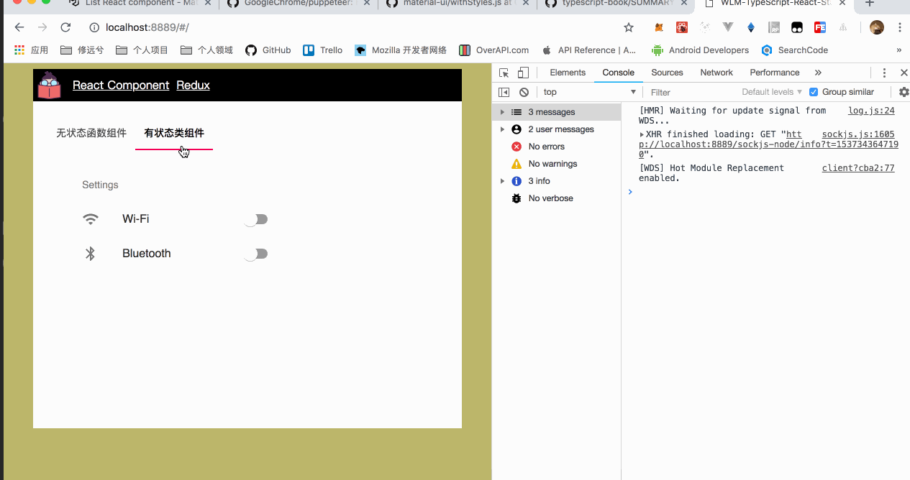
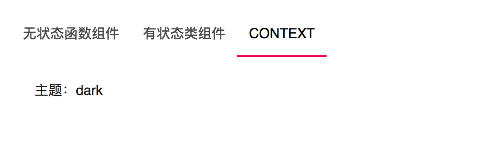

多数情况下我们一直都在使用 `Class Component` 的方式来书写 React 应用程序，这是它的一种经典模式，因为在 `Class Component` 中我们不仅可以享受全部的 React 特性，如：声明周期，事件系统等，还能利用好 `Class` 的特性更优雅的组织我们的代码。

一个经典的 `Class Component` 定义如下：

```javascript

import * as React from "react";

class Setting extends React.Component {
  public render() {
    return (
      <div>...</div>
    )
  }
}
```

先让我们来看一个案例，我们将用类组件的方式来完成 `Setting` 模块。



在类组件中，我们可以即可以使用 `props` ，也可以定义自己的 `state` ，通过 `state` 我们可以很方便的去改变界面。在 TypeScript 的世界中，React 的 Props 和 State 接收了一个范型类型，因此我们需要首先定义两个 interface 来给 React.Component:

```javascript
export interface ISettingProps {
  classes: any;
}
export interface ISettingState {
  checked: string[];
}
```

在上述的案例中由于是需要去获取用户是否打开了开关，于是我在 `ISettingState` 中定义了一个字符串数组，用于装载 checked 之后的类型，是 wifi 还是蓝牙。

于是，我们可以先定义一个大概的骨架型组件，如：

```javascript
class Setting extends React.Component<ISettingProps, ISettingState> {
  constructor(props: ISettingProps) {
    super(props);
    this.state = {
      checked: [],
    };
  }

  public render() {
    return (
      <div>...</div>
    )
  }
}
```

在这里我并没有使用到相关的生命周期方法，因此在这里就不讲解，相关同学可以自行查阅文档：[https://reactjs.org/docs/state-and-lifecycle.html](https://reactjs.org/docs/state-and-lifecycle.html) ，主要看 `Lifecycle`。

接着，我们还要定义一个处理相关状态的方法：

```javascript
public handleToggle(value: string) {
  const { checked } = this.state;
  const currentIndex = checked.indexOf(value);
  const newChecked = [...checked];
  if (currentIndex === -1) {
    newChecked.push(value);
  } else {
    newChecked.splice(currentIndex, 1);
  }
  this.setState({
    checked: newChecked,
  });
}
```

逻辑比较简单，如果传入的 `value` 存在就删除，不存在就添加到 checked 数组中，查看[完整范例](https://github.com/welearnmore/WLM-TypeScript-React-Component-Mode/tree/master/src/pages/ReactComponent/components/Setting) 。

完整的代码如下：

```javascript
import * as React from "react";
import { withStyles, createStyles } from "@material-ui/core/styles";
import List from "@material-ui/core/List";
import ListItem from "@material-ui/core/ListItem";
import ListItemIcon from "@material-ui/core/ListItemIcon";
import ListItemSecondaryAction from "@material-ui/core/ListItemSecondaryAction";
import ListItemText from "@material-ui/core/ListItemText";
import ListSubheader from "@material-ui/core/ListSubheader";
import Switch from "@material-ui/core/Switch";
import WifiIcon from "@material-ui/icons/Wifi";
import BluetoothIcon from "@material-ui/icons/Bluetooth";
import styles from "./style.css";
import {
  ISettingProps,
  ISettingState,
} from "./types";

const s = createStyles({});

class Setting extends React.Component<ISettingProps, ISettingState> {
  constructor(props: ISettingProps) {
    super(props);
    this.state = {
      checked: [],
    };
  }

  public componentDidMount() {
    //
  }

  public handleToggle(value: string) {
    const { checked } = this.state;
    const currentIndex = checked.indexOf(value);
    const newChecked = [...checked];
    if (currentIndex === -1) {
      newChecked.push(value);
    } else {
      newChecked.splice(currentIndex, 1);
    }
    this.setState({
      checked: newChecked,
    });
  }

  public render() {
    const { classes } = this.props;
    return (
      <div className={styles.container}>
        <List subheader={<ListSubheader>Settings</ListSubheader>}>
          <ListItem>
            <ListItemIcon>
              <WifiIcon />
            </ListItemIcon>
            <ListItemText primary="Wi-Fi" />
            <ListItemSecondaryAction>
              <Switch
                onChange={this.handleToggle.bind(this, "wifi")}
                checked={this.state.checked.indexOf("wifi") !== -1}
              />
            </ListItemSecondaryAction>
          </ListItem>
          <ListItem>
            <ListItemIcon>
              <BluetoothIcon />
            </ListItemIcon>
            <ListItemText primary="Bluetooth" />
            <ListItemSecondaryAction>
              <Switch
                onChange={this.handleToggle.bind(this, "bluetooth")}
                checked={this.state.checked.indexOf("bluetooth") !== -1}
              />
            </ListItemSecondaryAction>
          </ListItem>
        </List>
      </div>
    );
  }
}

export default withStyles(s)(Setting);

```

如果在一个类组件中，我们想获取到真实的 DOM 节点，最新版本的 React refs 有了一些变化，定义一个 `React.RefObject` 类型，并且使用 createRef 创建一个 ref：

```javascript
public divRef: React.RefObject<HTMLDivElement>;
this.divRef = React.createRef();
```

然后在 Node 上使用 ref={this.divRef}，当我们要获取时，也有一些不同，如下：

```javascript
this.divRef.current // dom 对象
```

在无状态函数组件中获取 ref 的方式如上，多数情况下我们并不要直接接触到 DOM 因此 Ref 的使用也在一些比较棘手的情况下，才能选择使用。

如果在一个类组件中，我们想使用 Context，最新版本的 React Context 也有了一个新的变化，Context 打破经典 React Component 数据流向的规律，但这个特性多数的库中都有运用到，因此如果我们要在组件之间去共享一段资源时，Context对于这种场景就非常的有用。

[完整范例](https://github.com/welearnmore/WLM-TypeScript-React-Component-Mode/tree/master/src/pages/ReactComponent/components/Context)

```javascript

import * as React from "react";
import styles from "./style.css";

const MyContext = React.createContext("light");

const Toolbar: React.SFC = (props) => {
  return (
    <div>
      <ThemedButton />
    </div>
  );
};

const ThemedButton: React.SFC = (props) => {
  return (
    <MyContext.Consumer>
      { (theme) => {
        return (
          <div>主题：{ theme }</div>
        );
      }}
    </MyContext.Consumer>
  );
};

export default class ContextPage extends React.Component {
  public render() {
    return (
      <MyContext.Provider value="dark">
        <Toolbar />
      </MyContext.Provider>
    );
  }
}

```



对于类组件来说，我们最重要的是根据它特点来设计符合我们场景的组件。