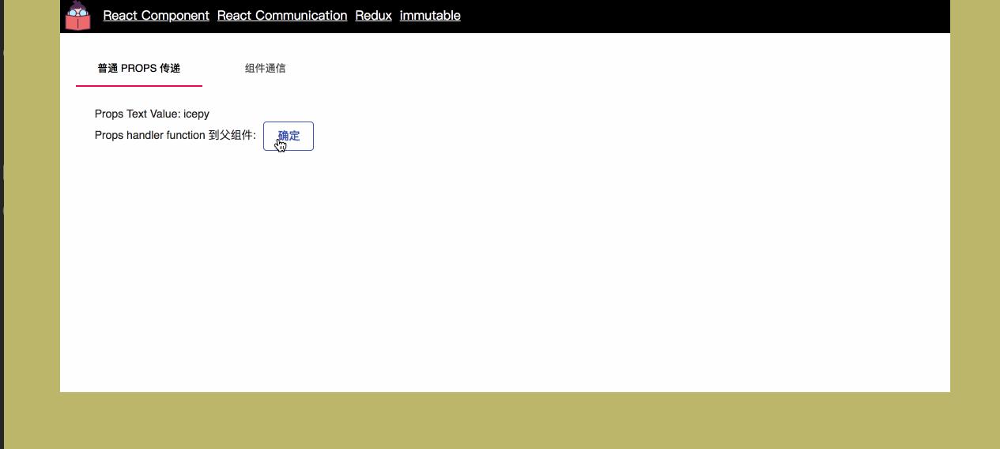

在 `React` 的世界中由于其本身的设计思路的原因，因此不同组件关于通信的问题，是一门很值得研究的基础方法，这些基础方法涵盖了在组件的使用过程中的方方面面，当然你也可以选择一些数据流的管理库来处理这个问题。那么，在 TypeScript 的世界里，我们又该如何去实现这些基础的通信方式呢？



## 普通 Props 传递

做为整个 `React` 的设计精髓 `Props` 来驱动整个数据的流向也就适应了它的使命，因此通过 `Props` 的传递，我们既可以解决从父组件到子组件的通信，也可以解决从子组件到父组件的通信。

从父组件将 `Props` 传递给子组件：

```javascript
import * as React from "react";

interface IProps {
  text: string;
}

class ChildComp extends React.Component<IProps> {
  constructor(props: IProps) {
    super(props);
  }

  public render() {
    const {
      text,
      handler,
    } = this.props;
    return (
      <React.Fragment>
        <Typography>
          Props Text Value: { text }
        </Typography>
      </React.Fragment>

    );
  }
}

export default ChildComp;

```

```javascript

export interface ICommunicationProps {}
export interface ICommunicationState {
  value: number;
}

import * as React from "react";
import Tabs from "@material-ui/core/Tabs";
import Tab from "@material-ui/core/Tab";
import Typography from "@material-ui/core/Typography";
import {
  ICommunicationProps,
  ICommunicationState,
} from "./types";
import ChildComp from "./components/ChildComp";

const TabContainer: React.SFC = (props) => {
  return (
    <Typography component="div" style={{ padding: 8 * 3 }}>
      {props.children}
    </Typography>
  );
};

class Communication extends React.Component<ICommunicationProps, ICommunicationState> {
  public childCompProps: string;
  constructor(props: ICommunicationProps) {
    super(props);
    this.state = {
      value: 0,
    };
    this.childCompProps = "icepy";
  }

  public handleChange = (event: React.ChangeEvent<{}>, value: any) => {
    this.setState({ value });
  }

  public render() {
    const { value } = this.state;
    return (
      <div>
        <Tabs value={value} onChange={this.handleChange}>
          <Tab label="普通 Props 传递" />
        </Tabs>
        {value === 0 && (
          <TabContainer>
            <ChildComp text={this.childCompProps}/>
          </TabContainer>
        )}
      </div>
    );
  }
}

export default Communication;

```

通过传递函数，让子组件与父组件进行通信：

```javascript
import * as React from "react";
import Typography from "@material-ui/core/Typography";
import Button from "@material-ui/core/Button";
import styles from "./style.css";

interface IProps {
  text: string;
  handler?: (result: string) => void;
}

class ChildComp extends React.Component<IProps> {
  constructor(props: IProps) {
    super(props);
  }

  public handlerClick = () => {
    const { handler } = this.props;
    if (handler) {
      handler("ChildComp");
    }
  }

  public render() {
    const {
      text,
      handler,
    } = this.props;
    return (
      <React.Fragment>
        <Typography>
          Props Text Value: { text }
        </Typography>
        { handler && (
          <Typography>
            Props handler function 到父组件:
            <span className={styles.cons}>
              <Button variant="outlined" onClick={this.handlerClick} color="primary">
                确定
              </Button>
            </span>
          </Typography>
        )}
      </React.Fragment>

    );
  }
}

export default ChildComp;

```

```javascript
import * as React from "react";
import Tabs from "@material-ui/core/Tabs";
import Tab from "@material-ui/core/Tab";
import Typography from "@material-ui/core/Typography";
import {
  ICommunicationProps,
  ICommunicationState,
} from "./types";
import ChildComp from "./components/ChildComp";

const TabContainer: React.SFC = (props) => {
  return (
    <Typography component="div" style={{ padding: 8 * 3 }}>
      {props.children}
    </Typography>
  );
};

class Communication extends React.Component<ICommunicationProps, ICommunicationState> {
  public childCompProps: string;
  constructor(props: ICommunicationProps) {
    super(props);
    this.state = {
      value: 0,
    };
    this.childCompProps = "icepy";
  }

  public handleChange = (event: React.ChangeEvent<{}>, value: any) => {
    this.setState({ value });
  }

  public emptyHandler = (result: string) => {
    alert(`child component click + ${result}`);
  }

  public render() {
    const { value } = this.state;
    return (
      <div>
        <Tabs value={value} onChange={this.handleChange}>
          <Tab label="普通 Props 传递" />
        </Tabs>
        {value === 0 && (
          <TabContainer>
            <ChildComp text={this.childCompProps} handler={this.emptyHandler} />
          </TabContainer>
        )}
      </div>
    );
  }
}

export default Communication;

```

## 基础组件通信

除了传递 `Props` 之外，也会有一些其他场景的地方需要完成组件之间的通信，比如兄弟节点之间，理论上 `Props` 可以涵盖基本所有的通信需求，之所以分别这其他几种方式出来，主要是从程序的设计角度来看，如果我们有一个很大的节点树，全部依赖 `Props` 会有比较多额外的 `麻烦`，这个麻烦并不是说程序不能运行，而是增加了很多额外的处理事项。

如果我们想将 A节点的数据传输给 B节点（它是在同一级），那么我们可以借助父节点来完成这次通信：

```javascript
import * as React from "react";
import Typography from "@material-ui/core/Typography";
import Button from "@material-ui/core/Button";
import styles from "./style.css";

interface IProps {
  handler: (result: string) => void;
}

class ChildCompsR extends React.Component<IProps> {

  constructor(props: IProps) {
    super(props);
  }

  public handlerClick = () => {
    const { handler } = this.props;
    handler("ChildCompsR");
  }

  public render() {
    return (
      <div className={styles.container}>
        <Typography>
          <span className={styles.cons}>
            <Button variant="outlined" onClick={this.handlerClick} color="primary">
              state 操作
            </Button>
          </span>
        </Typography>
      </div>
    );
  }
}

export default ChildCompsR;

```

```javascript
import * as React from "react";
import Tabs from "@material-ui/core/Tabs";
import Tab from "@material-ui/core/Tab";
import Typography from "@material-ui/core/Typography";
import {
  ICommunicationProps,
  ICommunicationState,
} from "./types";
import ChildCompsQ from "./components/ChildCompsS";
import ChildCompsR from "./components/ChildCompsS/ChildCompsR";

const TabContainer: React.SFC = (props) => {
  return (
    <Typography component="div" style={{ padding: 8 * 3 }}>
      {props.children}
    </Typography>
  );
};

class Communication extends React.Component<ICommunicationProps, ICommunicationState> {
  public childCompProps: string;
  constructor(props: ICommunicationProps) {
    super(props);
    this.state = {
      value: 0,
      brothersText: "",
    };
    this.childCompProps = "icepy";
  }

  public handleChange = (event: React.ChangeEvent<{}>, value: any) => {
    this.setState({ value });
  }

  public handlerChildCompsR = (result: string) => {
    this.setState({
      brothersText: result,
    });
  }

  public render() {
    const { value, brothersText, contextsText } = this.state;
    return (
      <div>
        <Tabs value={value} onChange={this.handleChange}>
          <Tab label="组件通信" />
        </Tabs>
        {value === 1 && (
          <TabContainer>
            <ChildCompsR
              handler={this.handlerChildCompsR}
            />
            <ChildCompsQ text={brothersText} />
          </TabContainer>
        )}
      </div>
    );
  }
}

export default Communication;

```

我们也可以通过 `观察者` 模式来处理同样的问题，如果你很了解它的话，那么这是一个非常的简单的处理方式，注册事件，发布事件就好，然后通过 `setState` 来变更数据的变化。

```javascript
import * as React from "react";
import Typography from "@material-ui/core/Typography";
import Button from "@material-ui/core/Button";
import Proxy from "wolfy87-eventemitter";
import styles from "./style.css";

interface IProps {
  proxy: Proxy;
}

class ChildCompsR extends React.Component<IProps> {

  constructor(props: IProps) {
    super(props);
  }

  public handlerProxyClick = () => {
    this.props.proxy.emit("ChildCompsP", "ChildCompsR");
  }

  public render() {
    return (
      <div className={styles.container}>
        <Typography>
          <span className={styles.cons}>
            <Button variant="outlined"onClick={this.handlerProxyClick} color="primary">
              观察者 操作
            </Button>
          </span>
        </Typography>
      </div>
    );
  }
}

export default ChildCompsR;

```

```javascript
import * as React from "react";
import Typography from "@material-ui/core/Typography";
import Proxy from "wolfy87-eventemitter";

interface IState {
  proxyText: string;
}

interface IProps {
  proxy: Proxy;
}

class ChildCompsP extends React.Component<IProps, IState> {
  constructor(props: IProps) {
    super(props);
    this.state = {
      proxyText: "",
    };
  }

  public componentDidMount() {
    this.props.proxy.on("ChildCompsP", (result: string) => {
      this.setState({
        proxyText: result,
      });
    });
  }

  public render() {
    const { proxyText } = this.state;
    return (
      <div>
        <Typography>
          Child Node ChildCompsP Proxy: { proxyText }
        </Typography>
      </div>
    );
  }
}

export default ChildCompsP;

```

```javascript
import * as React from "react";
import Proxy from "wolfy87-eventemitter";
import Tabs from "@material-ui/core/Tabs";
import Tab from "@material-ui/core/Tab";
import Typography from "@material-ui/core/Typography";
import {
  ICommunicationProps,
  ICommunicationState,
} from "./types";
import ChildCompsR from "./components/ChildCompsS/ChildCompsR";
import ChildCompsP from "./components/ChildCompsS/ChildCompsP";

const TabContainer: React.SFC = (props) => {
  return (
    <Typography component="div" style={{ padding: 8 * 3 }}>
      {props.children}
    </Typography>
  );
};

const proxy = new Proxy();

class Communication extends React.Component<ICommunicationProps, ICommunicationState> {
  public childCompProps: string;
  constructor(props: ICommunicationProps) {
    super(props);
    this.state = {
      value: 0,
      brothersText: "",
    };
    this.childCompProps = "icepy";
  }

  public handleChange = (event: React.ChangeEvent<{}>, value: any) => {
    this.setState({ value });
  }

  public render() {
    const { value, brothersText } = this.state;
    return (
      <div>
        <Tabs value={value} onChange={this.handleChange}>
          <Tab label="普通 Props 传递" />
        </Tabs>
        {value === 1 && (
          <TabContainer>
            <ChildCompsR
              proxy={proxy}
            />
            <ChildCompsP proxy={proxy} />
          </TabContainer>
        )}
      </div>
    );
  }
}

export default Communication;

```

依然我们也可以使用 `Context` 的机制完成这次通信，使用 `createContext` 创建一个 Context，然后在根组件中使用`MyContext.Provider` 将你被 `MyContext.Consumer` 包裹的组件包裹起来，通过 `value` 来共享这一块的数据。

```javascript
import * as React from "react";

export const MyContext = React.createContext("value");

```

```javascript
import * as React from "react";
import Typography from "@material-ui/core/Typography";
import { MyContext } from "../../context";

class ChildCompsC extends React.Component {
  public render() {
    return (
      <MyContext.Consumer>
        {(value) => {
          return (
            <Typography>
              Child Node ChildCompsC Context: {value}
            </Typography>
          );
        }}
      </MyContext.Consumer>
    );
  }
}

export default ChildCompsC;

```

```javascript
<MyContext.Provider value={contextsText}>
  <ChildCompsC />
</MyContext.Provider>
```

详情可参考 [https://github.com/welearnmore/WLM-TypeScript-React-Component-Mode/tree/master/src/pages/Communication](https://github.com/welearnmore/WLM-TypeScript-React-Component-Mode/tree/master/src/pages/Communication)

这些基础的通信方法在我们的开发工程中非常的有用，你应该牢记这些基础通信方法，为了更好的写 TypeScript 版的 React，你还应该对类型有一些对齐的约束，这个约束在越往后使用的过程中得到的收益才更大。