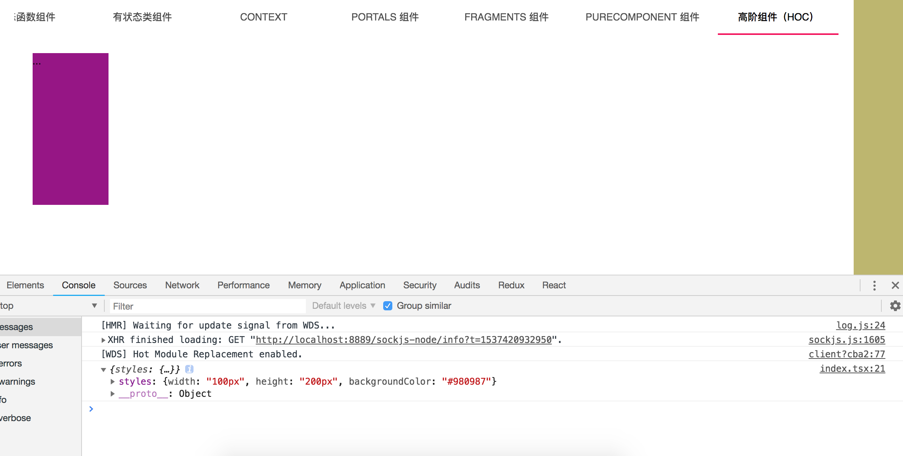

不知道你是否遇见过这样的情况，在以前 `React` render 方法返回的 Node 中，最外层必须是返回一个单一的 Node，因此我们有很多业务会有很多额外的 div ，如：

```javascript

// li
const renderLi: React.SFC = () => {
  return (
    <div>
      <p>1</p>
      <p>2</p>
    </div>
  )
}

public render() {
  return (
    <div>
      <renderLi />
    </div>
  )
}
```

- 它不是一个数组，如果是数组你可以直接 `return [].map((v) => { return (<p>{v}</p>)})` ，或者 `[]` 直接数组放JSX，这没有可比性
- 它就是有两个平级的元素需要渲染，可能这种情况会比较少见，但肯定有。

如果我们有很多场景需要使用它，那么我们就会生成很多有副作用的 `div`，这明显不是我们想要的结果。那么 `React` 根据这样的情况给予了一个组件来解决这个问题，它就是 `Fragment`。

```javascript
import * as React from "react";
import ListItem from "@material-ui/core/ListItem";
import ListItemIcon from "@material-ui/core/ListItemIcon";
import ListItemText from "@material-ui/core/ListItemText";
import InboxIcon from "@material-ui/icons/Inbox";
import DraftsIcon from "@material-ui/icons/Drafts";

class Columns extends React.Component {
  public render() {
    return (
      <React.Fragment>
        <ListItem button>
          <ListItemIcon>
            <InboxIcon />
          </ListItemIcon>
          <ListItemText primary="Inbox" />
        </ListItem>
        <ListItem button>
          <ListItemIcon>
            <DraftsIcon />
          </ListItemIcon>
          <ListItemText primary="Drafts" />
        </ListItem>
      </React.Fragment>
    );
  }
}

export default Columns;
```

这个组件就完美的解决了额外 div 的副作用，在父组件中，我们可以很方便的引用 `Columns` 组件：

```javascript
import * as React from "react";
import {
  IFragmentsProps,
  IFragmentsState,
} from "./types";
import List from "@material-ui/core/List";
import Columns from "./Columns";

class Fragments extends React.Component<IFragmentsProps, IFragmentsState> {
  constructor(props: IFragmentsProps) {
    super(props);
    this.state = {

    };
  }

  public render() {
    return (
      <List component="nav">
        <Columns />
      </List>
    );
  }
}

export default Fragments;

```



完成范例可查看 [https://github.com/welearnmore/WLM-TypeScript-React-Component-Mode/tree/master/src/pages/ReactComponent/components/Fragments](https://github.com/welearnmore/WLM-TypeScript-React-Component-Mode/tree/master/src/pages/ReactComponent/components/Fragments) 。