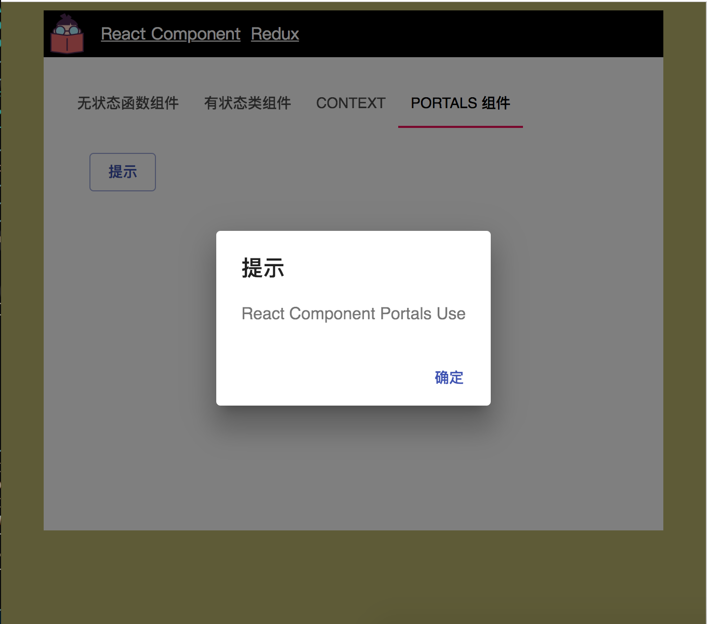

在很多场景下我们可能会有这样的一个需求，给予一个全局对话框或者提示什么的，它可以覆盖整个 Web 应用程序，如图：



这个需求真的太常见了，因此 `ReactDOM` 中提供了一个方法 `createPortal`，可以将节点渲染在父组件之外，但是你可以依然使用父组件上下文中的属性。这个特性在我所讲的全局对话框或者提示框中非常有用，它脱离了父节点的容器，插在最外层，在样式上就能通过 `position: fixed` 来覆盖整个文档树。

我们在 `state` 中定义了一个 `open`，它只接收一个布尔值，用于打开提示框或关闭提示框架，如：

```javascript
export interface IPortalsProps {}

export interface IPortalsState {
  open: boolean;
}
```

然后我们定义两个方法用于设置 `open`：

```javascript
public clickHandler = () => {
  this.setState({
    open: true,
  });
}

public clickHandlerClose = () => {
  this.setState({
    open: false,
  });
}
```

最后在 `render` 方法中使用 `ReactDOM.createPortal` 来创建一个全局的 `Alert`，如：

```javascript
import * as React from "react";
import * as ReactDOM from "react-dom";
import Button from "@material-ui/core/Button";
import Alert from "../Alert";
import {
  IPortalsProps,
  IPortalsState,
} from "./types";

class MyPortals extends React.Component<IPortalsProps, IPortalsState> {

  constructor(props: IPortalsProps) {
    super(props);
    this.state = {
      open: false,
    };
  }

  public clickHandler = () => {
    this.setState({
      open: true,
    });
  }

  public clickHandlerClose = () => {
    this.setState({
      open: false,
    });
  }

  public render() {
    const { open } = this.state;
    return (
      <div>
        <Button
          variant="outlined"
          color="primary"
          onClick={this.clickHandler}
        >
          提示
        </Button>
        {
          ReactDOM.createPortal(
            <Alert
              open={open}
              message="React Component Portals Use"
              handleClose={this.clickHandlerClose}
            />,
            document.getElementById("app")!,
          )
        }
      </div>
    );
  }
}

export default MyPortals;

```

完整的范例可参考 [https://github.com/welearnmore/WLM-TypeScript-React-Component-Mode/tree/master/src/pages/ReactComponent/components/Portals](https://github.com/welearnmore/WLM-TypeScript-React-Component-Mode/tree/master/src/pages/ReactComponent/components/Portals)。