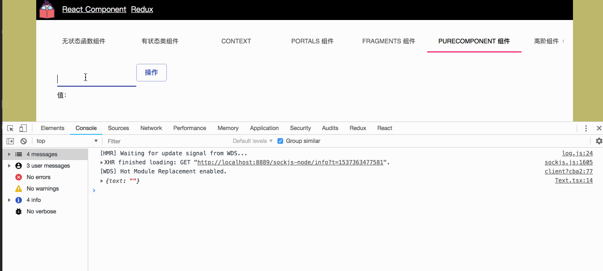

我们都知道 `React` 的刷新机制，因此如果每一次的变动都要刷新一下界面，这对于应用程序的性能来说是一个非常不科学的事情，因此在没有 `PureComponent` 之前，我们都需要手动使用 `shouldComponentUpdate?(nextProps: Readonly<P>, nextState: Readonly<S>, nextContext: any): boolean;` 来确认到底要不要刷新界面，如：

```javascript
import * as React from "react";
import Typography from "@material-ui/core/Typography";

interface IMyComparisonProps {
  text: string;
}

class MyComparison extends React.Component<IMyComparisonProps> {
  constructor(props: IMyComparisonProps) {
    super(props);
  }

  public shouldComponentUpdate(nextProps: IMyComparisonProps) {
    if (this.props.text === nextProps.text) {
      return false;
    }
    return true;
  }

  public render() {
    const { text } = this.props;
    return (
      <Typography>
        Component 值：{ text }
      </Typography>
    );
  }
}

export default MyComparison;
```

如果返回的是 `false` 那么将不调用 `render`，如果是 `true` 则调用 `render`。

但是如果我们使用 `PureComponent` 那么就省略了这一步，我们可以不用关心组件是否要刷新，而是 `React.PureComponent` 来帮我们决定。

在使用之前，我们还有一些注意事项要了解，`React.PureComponent` 是一个和 `React.Component` 几乎相同，唯一不同的是 `React.PureComponent` 帮助我们完成了 `shouldComponentUpdate` 的一些交浅的比较，因此在我们真实的组件设计中，我们一般会用于最后一个关键点的组件上。

让我们来看一个案例：



在这里我设计了一个输入框和一个按钮，在外部容器中，我们可以通过不同的输入来看，将 props 传入给显示的 MyText 组件，因此如果 props 相同的情况下，我们的 `MyText render` 方法并没有执行。

```javascript

import * as React from "react";
import Button from "@material-ui/core/Button";
import MyText from "./Text";
import TextField from "@material-ui/core/TextField";
import {
  IProps,
  IState,
} from "./types";
import styles from "./style.css";

class MyPureComponent extends React.Component<IProps, IState> {
  constructor(props: IProps) {
    super(props);
    this.state = {
      text: "",
      name: "",
    };
  }

  public handleChange = (e: React.ChangeEvent) => {
    const target = e.target as any;
    this.setState({
      name: target.value,
    });
  }

  public handleClick = () => {
    this.setState({
      text: this.state.name,
    });
  }

  public render() {
    const {
      name,
      text,
    } = this.state;
    return (
      <div>
        <div className={styles.container}>
          <div>
            <TextField
              id="standard-name"
              value={name}
              onChange={this.handleChange}
              margin="normal"
            />
          </div>
          <div className={styles.action}>
            <Button
              variant="outlined"
              color="primary"
              onClick={this.handleClick}
            >
              操作
            </Button>
          </div>
        </div>
        <MyText
          text={text}
        />
      </div>
    );
  }
}

export default MyPureComponent;

```

```javascript
import * as React from "react";
import Typography from "@material-ui/core/Typography";

interface IMyTextProps {
  text: string;
}

class MyText extends React.PureComponent<IMyTextProps> {
  constructor(props: IMyTextProps) {
    super(props);
  }

  public render() {
    const { text } = this.props;
    return (
      <Typography>
        值：{ text }
      </Typography>
    );
  }
}

export default MyText;

```

通过比较我们可以发现其实使用 `PureComponent` 是一个无感知的操作，并且它的变化需要我们注意的是，如果当数据结构特别复杂时，有可能会产生一定的错误，因此我更倾向于在设计组件是，在最后的 value 处使用 `PureComponent` ，至少可以相对的提升一些性能。