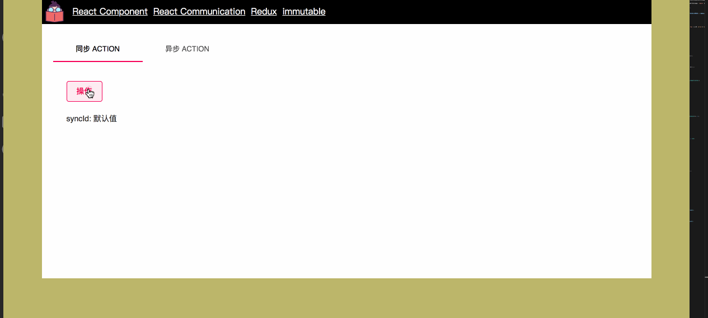

在阅读此篇文章之前，将默认你已经了解 Redux 的一些基础约束，如：`action`，`reducer` 等，对于在 TypeScript 的世界中使用 Redux ，对于其本身而言（指 Reudx）有很多不同的设计哲学，看于使用者来如何设计它。

有些朋友可能喜欢写很原汁原味的 `mapStateToProps` 和 `mapDispatchToProps`，如：

```javascript
export default connect(
  (state) => {
    return ...state
  },
  (dispatch) => {
    return {
      userLogin: (p) => {
        return dispatch(actions.userLogin(p))
      }
    }
  }
)(Home)
```

那么有些朋友可能喜欢使用 `bindActionCreators` 精简代码，如：

```javascript
import { bindActionCreators } from 'redux';
export default connect(
  (state) => {
    return ...state
  },
  (dispatch) => {
    return {
      userLogin: bindActionCreators(actions.userLogin, dispatch)
    }
  }
)(Home)
```

但我们明白从软件的设计的角度来说，除了必要的性能优化外，最主要的思考是着重于代码的阅读和可维护性，因此也许我的方式并不是最好的，但这是我个人使用起来最舒服的（优化是另外一个话题）。



我期望使用一个单独的文件来创建 Store，因为将来我们可以在这个单独的文件中去做一些优化，并且将 `reducer` 分割成每一个 `Page` 级别页面自己的子 `reducer`，如：

```javascript
import { createStore, applyMiddleware, combineReducers, compose } from "redux";
import thunk from "redux-thunk";
import { reduxReducers } from "@/pages/Redux/flow/reduxReducers";
import { globalReducers } from "./reducers";

const composeEnhancers = (window as any) && (window as any).REDUX_DEVTOOLS_EXTENSION_COMPOSE || compose;
const reducer = combineReducers({
  global: globalReducers,
  reduxPage: reduxReducers,
});

export const configureStore = () => createStore(
  reducer,
  composeEnhancers(applyMiddleware(thunk)),
);
```

我们用 `combineReducers` 来创建子 `reducer`，并且使用了 `thunk` 中间件。对于 `Page` 级别的 `action`，`reducer` 我习惯于将它们放置在具体组件的目录中，并创建一个 `flow` 目录；

我们可以定义一些接口，用于描述 action 即将返回的值，我将它设计成这样的结构：

```javascript
{
  type: "",
  payload: {
    data: T,
  };
}

```

因此，它的接口是：

```javascript
export interface IAction<T =any> {
  type: string;
  payload: {
    data: T,
  };
}
```

此外，对于全局的 StoreState ，我们也定义一个接口，用于描述 mapStateToProps 或，如：

```javascript

export interface IStoreState {
  reduxPage: IReduxPageStoreState;
  global: IGlobalStoreState;
}
```

接下来，我们来写一个 `reduxPage` 的 `reducer`，定义一个默认的 state ，并且个流程如下：

```javascript
import { IAction } from "@/global/types";
import * as CONST from "./constants";
import * as TYPES from "../types";

const initState: TYPES.IReduxPageStoreState = {
  syncId: "默认值",
  asyncId: "默认值",
};

export function reduxReducers(state = initState, action: IAction): TYPES.IReduxPageStoreState {
  const { type, payload } = action;
  switch (type) {
    case CONST.SYNC_DATA:
      return { ...state, syncId: payload.data };
    case CONST.ASYNC_DATA:
      return { ...state, asyncId: payload.data };
    default:
      return { ...state };
  }
}

```

然后我们写两个 `Action` ，一个是同步的，一个是异步的，如：

```javascript
import * as CONST from "./constants";
import { Dispatch } from "redux";
import { IAction } from "global/types";
import { IDataAsync, IDataSync } from "./types";

export const dataSync = (): IAction<IDataSync> => {
  const syncData  = {
    type: CONST.SYNC_DATA,
    payload: {
      data: "https://github.com/icepy",
    },
  };
  return syncData;
};

export const dataAsync = (parameter: string) => (dispatch: Dispatch<IAction<IDataAsync>>) => {
  const asyncData = {
    type: CONST.ASYNC_DATA,
    payload: {
      data: "https://icepy.me",
    },
  };
  setTimeout(() => {
    dispatch(asyncData);
  }, 2000);
};

```

最后，我们再定义一下 `Props` 的接口：

```javascript
import { IDataAsync, IDataSync } from "./flow/types";
export interface IReduxPageActionsProps {
  dataSync: () => IAction<IDataSync>;
  dataAsync: (parameter: string) => (dispatch: Dispatch<IAction<IDataAsync>>) => void;
}
```

整个代码如下：

```javascript
import * as React from "react";
import { connect } from "react-redux";
import * as actions from "./flow/actions";
import {
  IReduxPageProps,
  IReduxPageState,
} from "./types";
import { IStoreState } from "../../global/types";
import styles from "./style.css";
import Button from "@material-ui/core/Button";
import Tabs from "@material-ui/core/Tabs";
import Tab from "@material-ui/core/Tab";
import Typography from "@material-ui/core/Typography";

const TabContainer: React.SFC = (props) => {
  return (
    <Typography component="div" style={{ padding: 8 * 3 }}>
      {props.children}
    </Typography>
  );
};

class ReduxComponent extends React.Component<IReduxPageProps, IReduxPageState> {
  constructor(props: IReduxPageProps) {
    super(props);
    this.state = {
      value: 0,
    };
  }

  public actionDataSync = () => {
    this.props.dataSync();
  }

  public actionDataAsync = () => {
    this.props.dataAsync("icepy");
  }

  public handleChange = (event: React.ChangeEvent<{}>, value: any) => {
    this.setState({ value });
  }

  public render() {
    const { reduxPage } = this.props;
    const { syncId, asyncId } = reduxPage;
    const { value } = this.state;
    return (
      <div className={styles["container"]}>
        <div>
          <Tabs value={value} onChange={this.handleChange}>
            <Tab label="同步 Action" />
            <Tab label="异步 Action" />
          </Tabs>
        </div>
        <div className={styles["contents"]}>
        {value === 0 && (
        <TabContainer>
          <Button variant="outlined" color="secondary" onClick={this.actionDataSync}>
            操作
          </Button>
          <div className={styles["box"]}>
            syncId: { syncId }
          </div>
        </TabContainer>
        )}
        {value === 1 && (
        <TabContainer>
          <Button variant="outlined" color="primary" onClick={this.actionDataAsync}>
            操作
          </Button>
          <div className={styles["box"]}>
            asyncId: { asyncId }
          </div>
        </TabContainer>
        )}
        </div>
      </div>
    );
  }
}

const mapStateToProps = (state: IStoreState) => {
  const { reduxPage, global } = state;
  return {
    reduxPage,
    global,
  };
};

const ReduxPage = connect(mapStateToProps, actions)(ReduxComponent);
export default ReduxPage;

```

如果你想用 `ThunkDispatch`，可以从 `react-thunk` 包里导出；